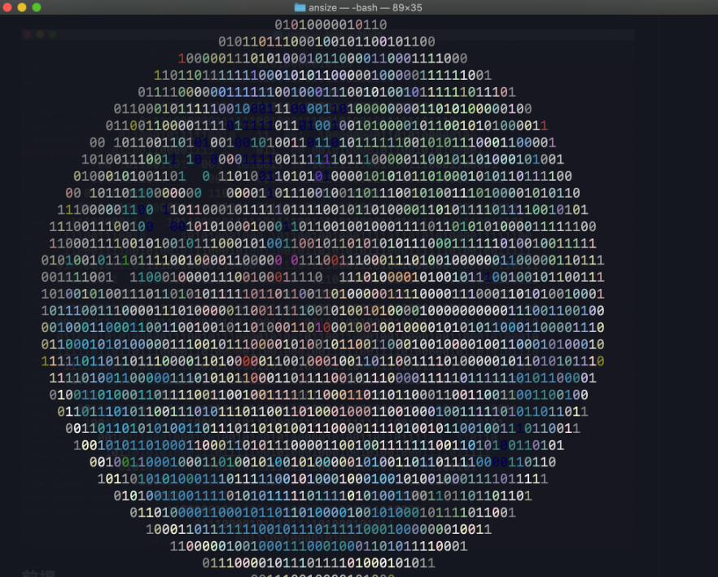

# ASCII Art Splash Screen

ターミナルにログインする度に、ASCII Artをランダムに出力します



## 前提

* MacOSでのみ動きます
* 事前にASCII Artのファイルを準備してください
  * [ansize](https://github.com/jasonmoo/ansize)を使用すると、好きな画像をASCII Artのファイルに変換できます
  * `txt`ファイルと`ascii`ファイルで動作確認済みです

## 使い方

1. `ascii.py`をダウンロードする。（レポジトリをクローンすると早いですが、このファイルだけでも問題ないです。）
2. ターミナルを開く
3. `ascii.py`をホームディレクトリ`~/.`に配置する
4. `settings.py`を作成して以下の通り記載する
   ```python
   artFileDir = "<ASCII Artのファイルを配置したディレクトリの絶対パス>"
   ```
5. `settings.py`をホームディレクトリ`~/.`に配置する
6. `.bash_profile`または`.bashrc`を開き、以下の通り記載する
   ```bash
   python3 -B ascii.py
   ```
   * 注意
     * デフォルトのシェルが`zsh`の場合はそちらに読み替えてください
     * `-B`は`__pycache__`ファイルを作成しないようにする（キャッシュ作成を行わない）ためのオプションです
7. `source ~/.bash_profile`または`source ~/.bashrc`コマンドを実行する

## 参考
* このレポジトリは、[ASCII-Art-Splash-Screen](https://github.com/DanCRichards/ASCII-Art-Splash-Screen)をフォークしています